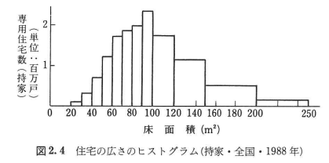
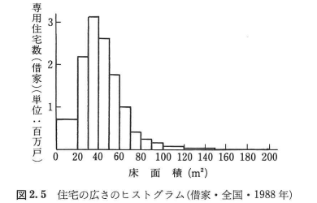

# 第2章 1次元のデータ

---
## 前置き

大量のデータを正しく効率的に読む手段として、記述統計学がある。
本章では、得られたデータのうち１つの属性に着目して、得られる情報を整理・要約するする方法を述べる。

---
# 2.1 度数分布とヒストグラム

調査や実験の結果が得られたとき、それを一覧化して整理する最も初歩的な方法は**度数分布表**を作ることである。例えば、以下のようなものがこれにあたる。

度数分布表は観測値をいくつかの**階級**に分割し、各階級ごとの**度数**(出現回数)を数えて表にしたものである。

観測値の解像度と階級は一致ししている必要はなく、観測値の範囲をひとまとめの階級としてもよい。このとき１つの階級を代表する値のことを**階級値**という（ふつうは階級内の上限と下限の中間を代表にする）。

---

通常の度数に大して**相対度数**とは、データ全体の大きさを１としたときの各階級ごとの出現割合のことである。特に大きさが異なるデータ群どうしを比較するときに有効である。（前頁の例でいうと、試験の点数分布を比較したいときに、受験生の数が毎年ピッタリ同じとは限らない）

---

**累積度数**、**累積相対度数**とは、度数を下の階級から積み上げて足した累積和である。例えば所得分布のように「年収400-450万の範囲が○○%」という度数よりも「年収450万円未満は○○%」のような累積度数が重視される場合がある。

---

実際の分布形状を視覚化する際にはグラフを作るとよい。度数分布表からは以下のような**ヒストグラム**を作ることができ、50点付近の度数が最も高いことや、左右対称の山型になっていることが一目で分かる。

ヒストグラムは各長方形の面積が頻度を意味しており、観測値によっては長方形の幅が階級ごとに異なることもある。

---

データによっては山の数が２つ以上(双峰型,bimodal)になる場合もある。そのような場合は複数種類の異質なデータが混ざっている可能性があり、適切なグループ分けによってひとつの山(単峰型,unimodal)にできることが多い。このような操作を**層別**という。例えば以下の床面積分布は双峰だが、持家と借家に分けることで単方になる。

 

このように、ヒストグラム作成は単なる現象理解にとどまらず、**現象の基礎にある本質**の発見につながることがある